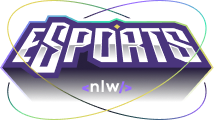

# NLW#eSports Version
This is an Application for gamers guided by the Rocketseat educators.

## Description
It's an application which is still being built and will allow users to connect themselves
with another gamers of the same game, by posting ads in which will be announced the
period, weekdays and also the discordUser.

It was developed in TypeScript. Using React in the web front-end and React-Native for
mobile version. For the back-end it was used Node.

The Database used in this project was SqlLite and with PrismaORM to integrate it properly
with JS.

Please Enjoy.

### Authors
:man_technologist: Norberto Boa

* **GitHuB:** @Norberto-Boa
* **LinkedIn:** Norberto Boa

### Contributing

Feel free to get in touch with me, in order to propose some new features and correct any mistake